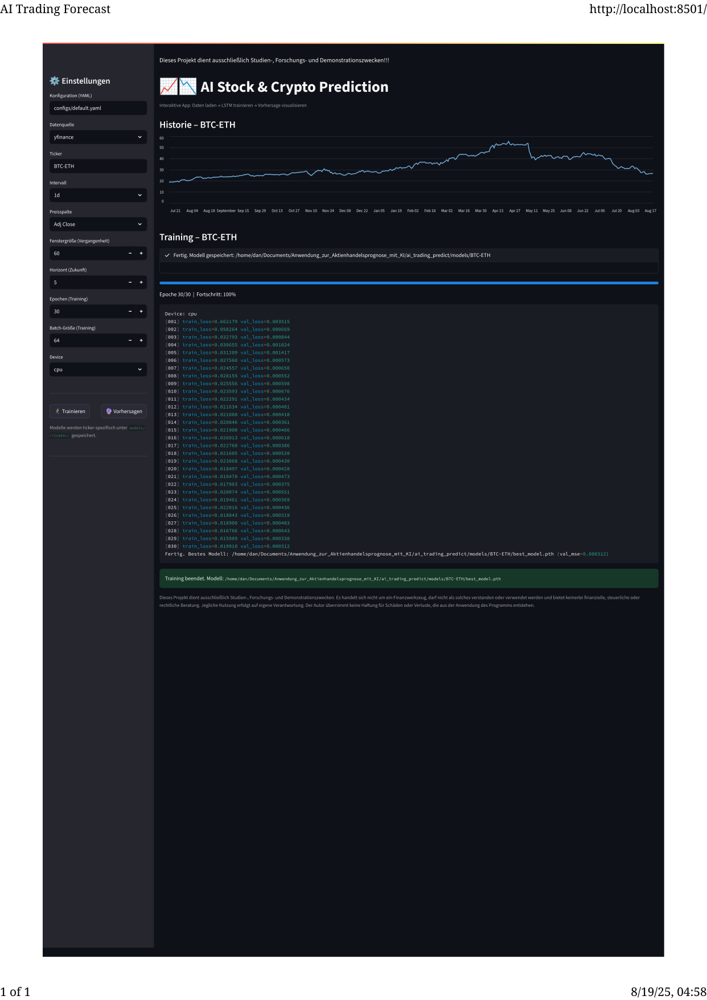
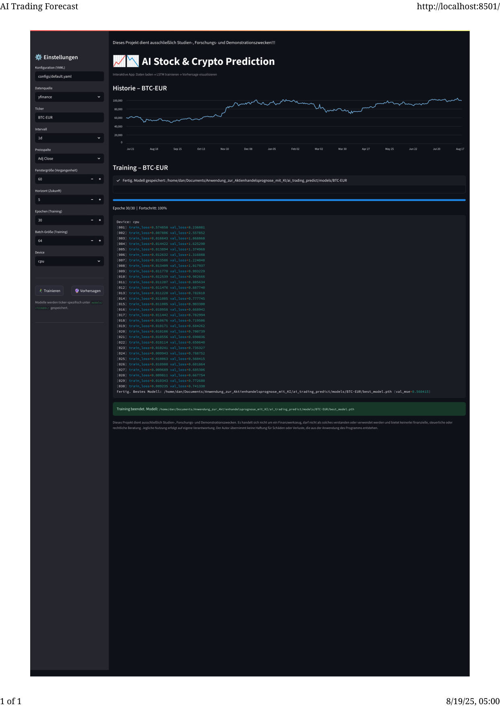
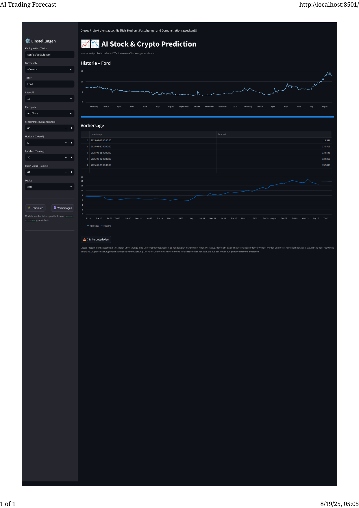

# AI Trading Predict — LSTM (PyTorch & Streamlit)
[](https://<dein-app-name>-<dein-user>.streamlit.app/)

Dieses Projekt dient ausschließlich Studien-, Forschungs- und Demonstrationszwecken.
Es handelt sich nicht um ein Finanzwerkzeug, darf nicht als solches verstanden oder verwendet werden und bietet keinerlei finanzielle, steuerliche oder rechtliche Beratung.
Jegliche Nutzung erfolgt auf eigene Verantwortung.
Der Autor übernimmt keine Haftung für Schäden oder Verluste, die aus der Anwendung des Programms entstehen.

---

## Projektbeschreibung

AI Trading Predict ist eine Anwendung zur Vorhersage von Kursen (Aktien, Währungen, Kryptowährungen) auf Basis von Long Short-Term Memory (LSTM)-Netzwerken.
Die App ermöglicht es, historische Daten aus [Yahoo Finance](https://pypi.org/project/yfinance/) oder [Stooq](https://stooq.com/) herunterzuladen und darauf Prognosen zu erstellen.

### Einsatzmöglichkeiten
- Aktienkurse (z. B. `AAPL`, `TSLA`)
- Währungspaare (z. B. `EURUSD=X`, `USDJPY=X`)
- Kryptowährungen (z. B. `BTC-USD`, `ETH-USD`, `BTC-ETH`)

Die App unterstützt alle Symbole, die in yfinance oder stooq verfügbar sind.

---

## Schnellstart

Falls Python-Umgebung und Abhängigkeiten bereits installiert sind:
```bash
streamlit run streamlit_app.py
```

---

## Installation und Nutzung

### Voraussetzungen
- Python ≥ 3.10 (empfohlen: 3.11)
- Git installiert
- Conda oder venv (optional, empfohlen)

### Installation unter Linux / macOS
```bash
# Repository klonen
git clone https://github.com/<DEIN_USERNAME>/ai_trading_predict.git
cd ai_trading_predict

# Conda-Umgebung erstellen
conda env create -f environment.yml
conda activate ai_trading_py311

# oder alternativ mit pip
pip install -r requirements.txt
```

### Installation unter Windows (PowerShell)
```powershell
# Repository klonen
git clone https://github.com/<DEIN_USERNAME>/ai_trading_predict.git
cd ai_trading_predict

# Conda-Umgebung
conda env create -f environment.yml
conda activate ai_trading_py311

# oder mit pip
pip install -r requirements.txt
```

### Anwendung starten

Training:
```bash
python src/train.py --config configs/default.yaml
```

Vorhersage:
```bash
python src/predict.py --config configs/default.yaml
```

Streamlit-App starten:
```bash
streamlit run streamlit_app.py
```

Die App ist anschließend im Browser erreichbar unter:
http://localhost:8501

---

## Konzept und Technologien

- Backend: Python 3.11, [PyTorch](https://pytorch.org/) für LSTM-Modellierung
- Frontend: [Streamlit](https://streamlit.io/) für die interaktive Weboberfläche
- Datenquellen: [yfinance](https://github.com/ranaroussi/yfinance), [stooq](https://stooq.com/)
- Modell: LSTM für Zeitreihenprognosen
- Hilfsmittel: YAML-Konfigurationen, Logging, CSV-Export

---

## Projektstruktur

```
ai_trading_predict/
│
├── configs/                # Konfigurationsdateien
│   └── default.yaml
│
├── models/                 # Gespeicherte Modelle (.pth)
│   └── .gitkeep
│
├── outputs/                # Trainings-Logs, Vorhersagen, CSVs
│   └── .gitkeep
│
├── src/
│   ├── data/               # Datenhandling
│   │   └── datasets.py
│   ├── models/             # ML-Modelle
│   │   └── lstm.py
│   ├── utils/              # Hilfsfunktionen
│   │   └── config.py
│   ├── train.py            # Training des Modells
│   └── predict.py          # Vorhersagen
│
├── streamlit_app.py        # Web-App (Streamlit)
├── requirements.txt        # Python-Dependencies
├── environment.yml         # Conda-Umgebung
├── .gitignore
├── LICENSE
└── README.md
```

---

## Funktionen

- Datenimport aus Yahoo Finance & Stooq
- Wahl des Zeitraums und Tickersymbols
- LSTM-Training mit einstellbaren Parametern (Fenstergröße, Epochen, Batchgröße)
- Prognose zukünftiger Werte (z. B. nächster Tag / mehrere Tage)
- Visualisierung der echten und vorhergesagten Werte
- Export von Vorhersagen nach CSV
- Streamlit-Interface mit Fortschrittsanzeige

---

## LSTM – Kurz erklärt

Long Short-Term Memory (LSTM) ist ein spezielles rekurrentes neuronales Netzwerk (RNN), das besonders für Zeitreihen-Daten geeignet ist.
Es löst das Problem des „Vergessens“ in Standard-RNNs durch Gedächtniszellen und Gating-Mechanismen.
Dadurch kann ein LSTM sowohl kurzfristige Schwankungen als auch langfristige Trends in Finanzdaten erfassen.

---

## Skripte

- `src/train.py` – Trainiert ein LSTM auf historischen Daten
- `src/predict.py` – Führt Vorhersagen mit trainiertem Modell aus
- `streamlit_app.py` – Interaktive Oberfläche für Training und Prognosen
- `setup.sh` / `setup.ps1` – Optionale Setup-Skripte zum Einrichten und Starten der App

---

## Screenshots

Beispiele der Streamlit-Anwendung:





---

## Urheberrecht und Lizenz

© 2025 Danut Matinca. Alle Rechte vorbehalten.

Lizenz: **PolyForm Noncommercial 1.0.0**. Siehe `LICENSE`.
Nicht-kommerzielle Nutzung ist erlaubt; kommerzielle Nutzung ist untersagt, sofern nicht schriftlich genehmigt.
SPDX-Identifier: `Polyform-Noncommercial-1.0.0`

